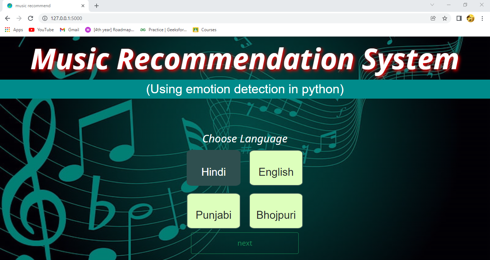
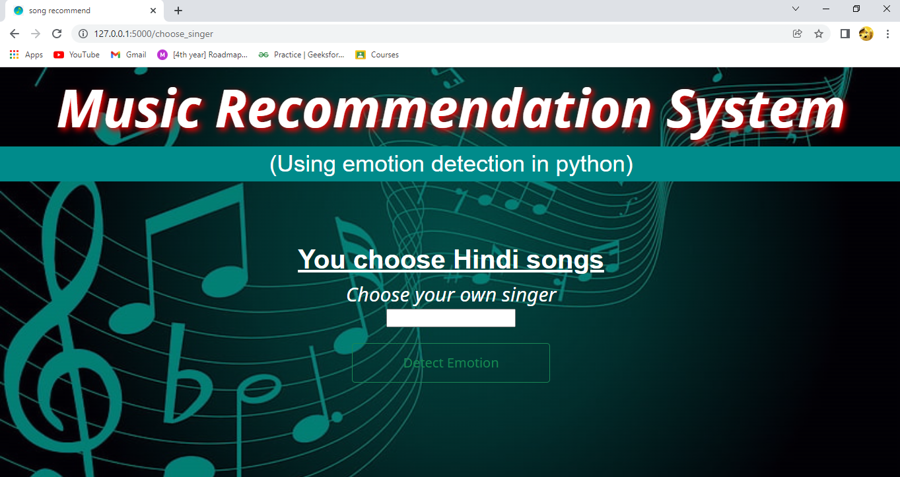
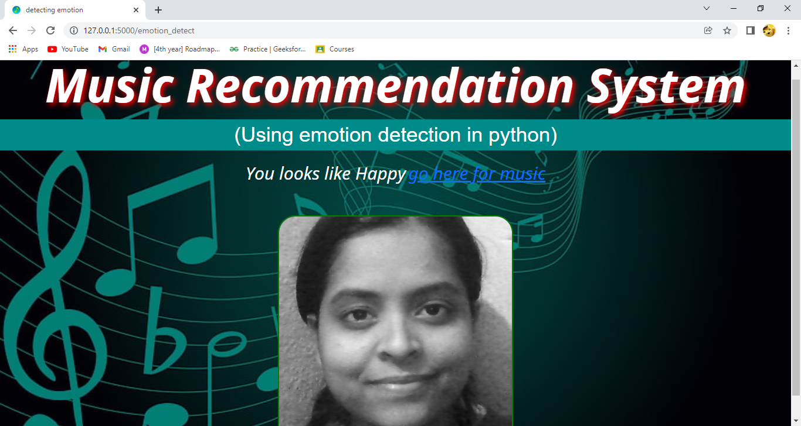
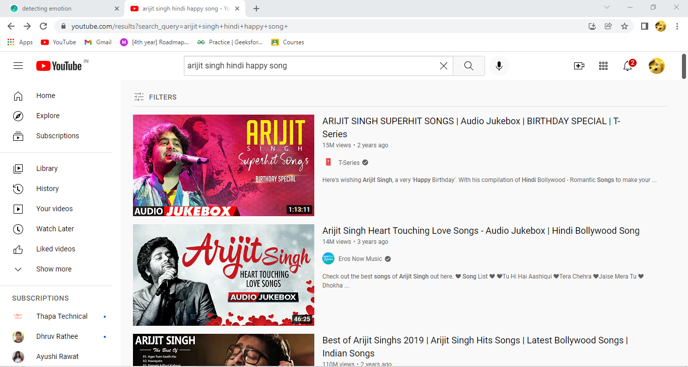

<h2 align="center">
  MOHIT PRASAD
</h2>
 

You can fork this repo. Please give me proper credit. Thanks!

EmoSongify is a Emotion Based Music Recommendation System webapp which can guess your emotion through your facial expressions and can recommend songs accoringly. 

# Tech Stack :

## Front-end
- HTML5
- CSS3
- Bootstrap

## Back-end
- Python

# Features

**📖 Multi-Page Layout**

**🎨 Styled with Bootstrap and Css**

**🧑 Detects emotion through facial expression**

**🎼 Recommends songs on YouTube according to your mood**

# Show your support

Give a ⭐ if you like this project!

# Result of this project

